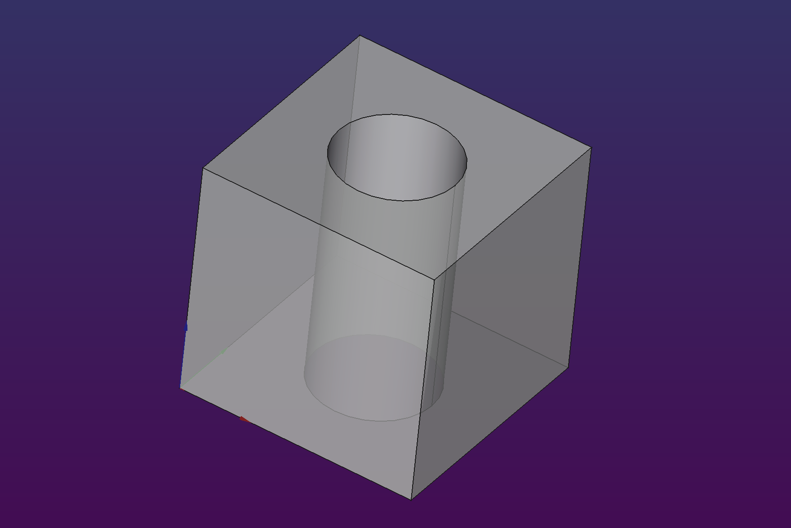
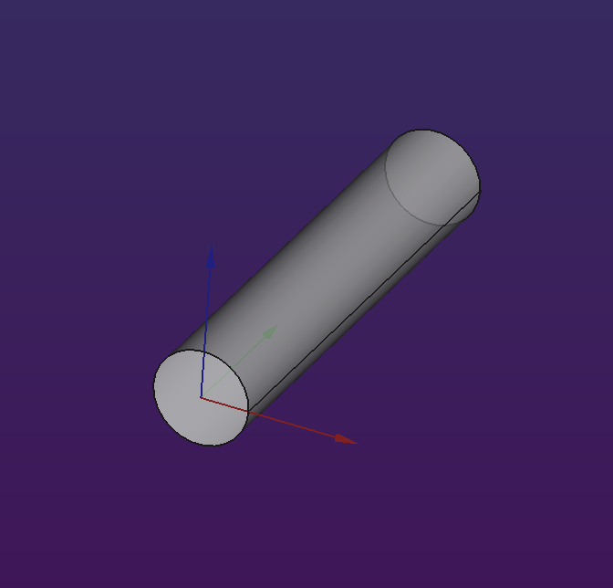

# Fumbler

Fumbler is a small library created in order to make it easier
to create simple parts in FreeCAD.

The reason is exists is that so the author, a programmer,
can have a good time writing code that generate things
to make on a 3D printer. The reason it's published is so that
we can easily share raw shape definitions, collaborate,
and adjust designs to our particular needs.

One great advantage of Fumbler is that you can freely mix and match
the programmatic approach with FreeCAD edit interface.
I often leverage this by creating complex boolean operations
in the code (where it is faster for me) and then finishing my part
with edge operations in the Part workspace
(where it's much easier to visualize).


# Installation


# WrappedDocument

This is the class that wraps a FreeCAD document and allows us
to create new parts inside it.

Your typical Fumbler script will first create a single document object,
then use it all over the place to `make` new things.


+-------------------------------------------------------------+
| ```
| A = fumbler.create_wrapped_document("A cube with a hole") 
| A.make_cube(20, 20, 20).cut([
|   A.make_cylinder(5, 20).move((10, 10, 0))
| ])
| A.flush()
| ```
+-------------------------------------------------------------+
| 
+-------------------------------------------------------------+


Don't forget to `flush` at the end of your script to refresh the UI!

## Creating things

You should use `plot_*`, `draw_*` or `make_*` methods, depending on
whether the thing you're creating is one, two or three-dimensional.


## Plot methods

These are mostly used internally by `draw_*` methods, but may come in handy
if you want to construct a flat shape from individual segments.

### `plot_line(x0, y0, x1, y1)`

> (x0, y0) – line starting point\
> (x1, y1) - line ending point\

Draws a straight line between two points.

### `plot_arc(cx, cy, r, startAngleDeg, endAngleDeg)`

> (cx, cy) - center of the circle\
> r - radius of the circle\
> startAngleDeg – starting angle of the arc (0° being ???)\
> endAngleDeg – endign angle of the arc\

Draws a circle arc around a center point.


## Draw methods

### `draw_circle(r, cap=CircleCap.None, angle=60, name="Circle")`

> r – radius of the circle\
> cap – cap method for the top part of the circle\
> angle – maximum overhang angle permitted\
> name – part name\

Draws a circle with a given radius.
The circle is contained in the base plane (`z=0`)
and the (0, 0) point is the center.
You can `move` and `rotate` the circle afterwards


- `CircleCap.None` - draws a full circle
- `CircleCap.Flat` - draws a
- `CircleCap.Point` - draws
- `CircleCap.RightPoint` - draws
- `CircleCap.LeftPoint` - draws


### `draw_rect()`

### `draw_rounded_rect()`

### `draw_chamfered_rect()`

### `draw_polygon()`

### `draw_cubic()`

## Make methods

### `make_cube()`

### `make_cylinder()`

### `make_loft()`

### `make_polyhedron()`

### `make_fuse()`

## Utilities

### `recompute()`

Recalculates the geometry inside a document
after major modifications, like boolean or edge operations.
Used internally in all such methods, so in most cases
you don't need to worry about recomputing yourself.
But it's here if you do things manually and things go awry.

### `flush()`

Refreshes the UI and ensures the contents of the document
are visible. Remember to `flush` at the end of your script!

### `remove_and_clean(part)`

Removes a part and all its descendants from the document.

The reason this is a bit tricky is that some operations
(i.e. chamfer and fillet) require the original shape to remain
in the document as a linked object. If we simply removed
the part we want, these leftovers would linger in the document tree
and pollute the element browser.
The `remove_and_clean` method gets rid of all such potential ghosts.


# WrappedPart

This class wraps a FreeCAD Part object
and makes it easier to manipulate it


## Geometric operations

### `move(delta)`

Moves the part by specified vector.

```
# Create a cube with base centered on the base plane.
A.make_cube(10, 10, 10).move((-5, -5, 0))
```

### `elevate(dz)`

Shorthand for `move((0, 0, dz))`, moves the part on the z axis only.

Most useful when distributing slices for the `make_loft` method.


### `rotate(axis, angle)`

Rotates the element around specified axis.

+-------------------------------------------------+
| ```                                             |
| # Create a horizontal cylinder                  |
| A.make_cylinder(2, 20).rotate((1, 0, 0), -90)   |
| ```                                             |
+-------------------------------------------------+
|                     |
+-------------------------------------------------+

## Boolean operations

### `fuse()`

### `cut()`


### `intersect()`

## Edge operations

### `chamfer()`

### `fillet()`

## Utilities

### `remove_and_clean()`

### `rename(name)`

### `recolor(color, transparency)`

### `hide()`


# Global utilities

### `epsilon`

Defined as `0.001` or similarly imperceptible number,
it's a handy constant you can use if you need to
slightly shift two shapes before performing
a boolean operation.

